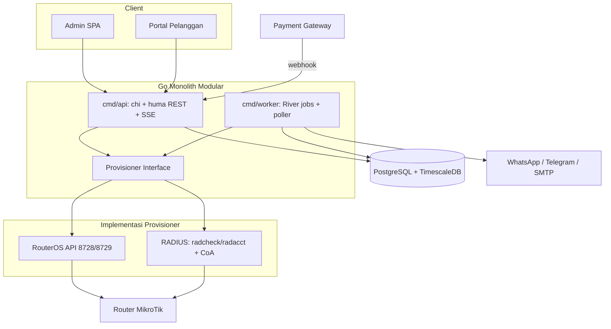

# drp-billing - Aplikasi Billing ISP MikroTik

## Ringkasan Keputusan

Workspace kosong, tooling siap: Go 1.25.3, Node 24.18, PostgreSQL 14, Docker 29. Berdasarkan jawabanmu: provisioner **hybrid** (RouterOS API dulu, abstraksi siap RADIUS), frontend **React**, dan scope penuh (multi-tenant, payment, notifikasi, monitoring, ticketing, akunting, FTTH/ODP).

Catatan: PostgreSQL 14 lokal masih cukup untuk development, tetapi produksi menargetkan **PostgreSQL 16+** yang dipasang native melalui aaPanel atau repository resmi PostgreSQL. TimescaleDB dipakai opsional untuk tabel time-series traffic.

## Stack yang Disarankan

**Backend (Go)**
- HTTP: `net/http` + `go-chi/chi` v5, dibungkus `danielgtaylor/huma` v2 sehingga handler typed sekaligus auto-generate OpenAPI 3.1 (dipakai untuk generate TS client di FE)
- DB: `jackc/pgx` v5 + `sqlc` (query type-safe, tanpa overhead ORM), migrasi dengan `pressly/goose`
- Job queue & scheduler: `riverqueue/river` - Postgres-backed, tidak butuh Redis, punya periodic jobs, retry, dan unique jobs (penting untuk billing idempoten)
- RouterOS: `github.com/go-routeros/routeros/v3` (MIT, `Dial` 8728 / `DialTLS` 8729, context-aware)
- Auth: JWT access token pendek + refresh token httpOnly cookie, hash password `argon2id`, TOTP 2FA admin (`pquerna/otp`)
- Lain: `log/slog`, `caarlos0/env` untuk config, `go-playground/validator`, `prometheus/client_golang`, PDF invoice via `johnfercher/maroto` v2
- Opsional: Redis hanya jika perlu fan-out SSE multi-instance dan rate limit terdistribusi. Single instance cukup pakai Postgres `LISTEN/NOTIFY`

**Frontend (React)**
- Vite 7 + React 19 + TypeScript, `@tanstack/react-router` (type-safe routing) + `@tanstack/react-query` v5
- Tabel: `@tanstack/react-table` v8 + `@tanstack/react-virtual`, semua pagination/sort/filter dikerjakan server-side
- Chart: Apache ECharts via `echarts-for-react` dengan custom build (canvas-based, tahan puluhan ribu titik data - jauh lebih ringan dari Recharts untuk grafik traffic)
- UI: Tailwind CSS v4 + shadcn/ui (Radix), form `react-hook-form` + `zod`
- API client: `openapi-typescript` + `openapi-fetch` (generated dari OpenAPI backend, runtime ~6kB)
- Map FTTH: `react-leaflet` + OpenStreetMap tiles
- i18n `i18next` (default Bahasa Indonesia, siap EN)
- Satu Vite app dengan dua route tree (`/admin/*` dan `/portal/*`) yang lazy-loaded terpisah, sehingga portal pelanggan tetap ringan

**Infra**
- Target deployment: Linux (Ubuntu 22.04/24.04 atau Debian 12) yang dikelola melalui **aaPanel**
- Nginx dari aaPanel menangani domain, SSL Let's Encrypt, gzip/Brotli, static assets, reverse proxy `/api` dan `/events` ke Go di `127.0.0.1:8080`
- `drp-api` dan `drp-worker` berupa binary Go native, dijalankan sebagai user non-root melalui unit `systemd` terpisah dengan auto-restart dan hardening
- Hasil build Vite disajikan langsung oleh Nginx dari `/www/wwwroot/drp-billing/web`; binary Go tidak perlu melayani file frontend
- PostgreSQL 16+ dipasang native; hanya bind ke localhost/private network, backup memakai `pg_dump` terjadwal plus retensi dan salinan off-server
- Secrets disimpan di `/etc/drp-billing/drp-billing.env` dengan permission `0600`, bukan di repository atau panel environment yang dapat dibaca user lain
- Redis tidak diperlukan pada deployment awal; River memakai PostgreSQL. Tambahkan Redis native hanya saat aplikasi dijalankan multi-instance
- Deploy atomik melalui release directory `/opt/drp-billing/releases/<version>` dan symlink `current`, lalu migrasi database, reload service, health check, dan rollback symlink jika gagal
- CI: GitHub Actions (golangci-lint, go test -race, vitest, Playwright smoke, build binary Linux amd64/arm64 dan arsip frontend)

**Layout server aaPanel**

```text
/opt/drp-billing/
  current -> releases/<version>
  releases/<version>/{drp-api,drp-worker,migrations}/
/www/wwwroot/drp-billing/web/
/etc/drp-billing/drp-billing.env
/var/lib/drp-billing/{uploads,exports,router-backups}/
/var/log/drp-billing/
```

aaPanel dipakai untuk pengelolaan Nginx, domain, SSL, PostgreSQL, firewall, dan backup. Proses Go tetap dikelola `systemd`, bukan Supervisor/PM2, karena dukungan restart, dependency, hardening, dan log `journald` lebih baik untuk service Linux.

## Arsitektur



## Integrasi RouterOS

Router disimpan sebagai `address` (IP **atau** domain/DDNS) + `port` (default 8728) + `use_tls`, di-dial dengan `net.JoinHostPort` sehingga `router.example.com:8728` dan `10.0.0.1:8729` sama-sama jalan:

```go
addr := net.JoinHostPort(r.Address, strconv.Itoa(r.Port)) // default 8728
if r.UseTLS {
    c, err = routeros.DialTLSContext(ctx, addr, user, pass, tlsCfg)
} else {
    c, err = routeros.DialContext(ctx, addr, user, pass)
}
```

- **Connection manager** per router: pool kecil (RouterOS batasi concurrency), health check periodik, reconnect exponential backoff, per-command timeout, circuit breaker agar router mati tidak membuat request API menggantung
- **Kredensial terenkripsi** di DB dengan AES-256-GCM (key dari env, siap rotasi), tidak pernah dikembalikan ke FE
- **Ownership tagging**: setiap entri yang dibuat app diberi `comment=drp:<service_id>` agar reconciler bisa membedakan milik app vs manual
- **Reconciler**: job berkala membandingkan desired state di DB vs actual state di router, menampilkan drift dan menawarkan apply (dengan mode dry-run diff)
- **Audit log** untuk setiap command yang dikirim ke router (siapa, kapan, command, hasil)

Abstraksi provisioner (kunci untuk hybrid):

```go
type Provisioner interface {
    Apply(ctx context.Context, s *ServiceSpec) error   // create/update, idempoten
    Suspend(ctx context.Context, s *ServiceSpec) error // isolir: pindah ke profile walled-garden
    Resume(ctx context.Context, s *ServiceSpec) error
    Remove(ctx context.Context, s *ServiceSpec) error
    Disconnect(ctx context.Context, s *ServiceSpec) error
    ActiveSessions(ctx context.Context, routerID int64) ([]Session, error)
    Capabilities() Caps
}
```

Implementasi: `provision/routeros` (PPP Secret, Hotspot User, DHCP lease + address-list, queue), `provision/radius` (tulis `radcheck`/`radreply` di Postgres yang sama dengan FreeRADIUS `rlm_sql`, plus Disconnect-Request/CoA lewat `layeh.com/radius`). Pemilihan implementasi per-router lewat kolom `routers.provisioner`.

## Model Data Inti

Multi-tenant memakai `tenant_id` di semua tabel + **Postgres Row Level Security**, di-set per transaksi (`SET LOCAL app.tenant_id`) oleh middleware, sehingga kebocoran data antar tenant tercegah di level DB bukan hanya di kode.

Kelompok tabel utama:
- Identity: `tenants`, `users`, `roles`, `permissions`, `user_tenants`, `api_keys`, `audit_logs`, `settings`
- Pelanggan & layanan: `customers` (punya login portal sendiri), `customer_addresses`, `plans` (profil bandwidth, harga, siklus, kuota/FUP, tipe layanan), `subscriptions`, `subscription_changes`
- Jaringan: `sites`, `routers`, `router_credentials`, `ip_pools`, `ip_assignments` (IPAM), `router_backups`
- Billing: `invoices`, `invoice_items`, `payments`, `payment_intents`, `wallets`, `wallet_transactions`, `discounts`, `taxes`, `late_fees`
- Prepaid: `voucher_batches`, `vouchers`
- Operasional: `tickets`, `ticket_messages`, `work_orders`, `technicians`
- FTTH: `odcs`, `odps`, `odp_ports`, `drop_cables`, `coverage_areas`
- Akunting: `chart_of_accounts`, `journal_entries`, `journal_lines`, `expenses`, `cash_accounts`
- Time-series: `sessions` (mirip radacct), `traffic_samples`, `router_metrics`, `service_status_history` - tabel partisi bulanan (atau hypertable TimescaleDB) + continuous aggregate untuk grafik jangka panjang
- Notifikasi: `notification_templates`, `notification_queue`, `notification_logs`

## Fitur Tambahan yang Direkomendasikan

Fitur tambahan yang paling berdampak untuk operasional ISP:

- **Auto-isolir + walled garden**: saat jatuh tempo lewat grace, subscription dipindah ke profile isolir yang meredirect semua HTTP ke halaman tagihan/pembayaran. Begitu pembayaran masuk (webhook), restore otomatis dalam hitungan detik
- **Dunning otomatis**: reminder H-7, H-3, H-0, H+1, H+3 via WhatsApp/Telegram/email dengan template per tenant
- **WhatsApp bot dua arah**: pelanggan kirim "tagihan" / "status" / "gangguan" dan dibalas otomatis, sekaligus bisa membuat tiket. Provider di-abstraksi (`Notifier` interface) supaya bisa WAHA self-hosted, Fonnte/Wablas, atau Meta Cloud API
- **Deteksi gangguan berbasis topologi**: jika banyak pelanggan di satu ODP/OLT offline bersamaan, sistem menaikkan alert "dugaan kabel putus di ODP-X" alih-alih membanjiri alert per pelanggan
- **Peta FTTH interaktif**: ODC/ODP/pelanggan di Leaflet, occupancy port per ODP, dan *coverage check* untuk calon pelanggan (input alamat, sistem cari ODP terdekat yang masih punya port kosong)
- **Portal teknisi mobile-friendly**: work order instalasi/perbaikan, check-in GPS, upload foto, assign port ODP, dan aktivasi layanan langsung dari lapangan
- **Backup config router otomatis**: export `.rsc` berkala via API, disimpan berversi dengan diff antar versi - penyelamat saat router bermasalah
- **Bulk config push & template**: jalankan perubahan (profile, queue, firewall) ke banyak router sekaligus dengan preview dan rollback plan
- **Reseller/agen**: portal terpisah, harga jual sendiri, komisi otomatis, saldo deposit
- **Lead & sales pipeline**: calon pelanggan dari coverage check masuk pipeline sampai jadi work order instalasi
- **Manajemen kuota/FUP**: auto-switch ke profile bandwidth lebih rendah saat kuota habis, reset per siklus
- **Ledger pembayaran immutable + double-entry** ke `journal_entries`, sehingga laporan laba/rugi dan arus kas konsisten dengan billing
- **Laporan bisnis**: MRR, ARPU, churn, aging receivable, collection rate, revenue per POP/paket, export XLSX/CSV dan laporan terjadwal via email
- **Importer MySQL legacy**: CLI baca MySQL legacy (tbl_customers) dan migrasikan pelanggan, supaya migrasi tidak dari nol
- **Public API + webhook keluar** dengan API key per tenant, untuk integrasi pihak ketiga
- **Keamanan**: 2FA admin, IP allowlist admin, session management, rate limit login, dan audit trail penuh

## Struktur Repo

```
drp-billing/
  cmd/{api,worker,migrate,drpctl}/
  internal/
    config/ db/ httpx/ auth/ tenant/ audit/
    customer/ plan/ subscription/ router/ ipam/
    billing/ invoice/ payment/{midtrans,xendit,tripay,manual}/
    voucher/ ticket/ workorder/ ftth/ accounting/ report/
    notify/{whatsapp,telegram,email}/
    monitor/ provision/{routeros,radius}/
    job/
  queries/          # sqlc
  migrations/       # goose
  web/              # Vite React app (admin + portal)
  deploy/           # nginx aaPanel, systemd, install/upgrade/rollback scripts
  docs/             # ADR, RouterOS setup, API
```

## Roadmap Bertahap

Setiap fase menghasilkan aplikasi yang bisa dijalankan, bukan potongan setengah jadi.

1. **Fondasi**: monorepo, konfigurasi native Linux/aaPanel (Nginx + PostgreSQL + systemd), goose+sqlc+River, huma/chi, auth+RBAC+RLS multi-tenant, shell React (layout, sidebar, tema, generated API client)
2. **Master data & RouterOS**: CRUD router (host/domain:port, tes koneksi), connection manager, provisioner RouterOS, plan, customer, subscription, IPAM
3. **Billing core**: siklus prepaid & postpaid, generate invoice, proration, pajak, pembayaran manual, auto-isolir + walled garden, portal pelanggan
4. **Uang & komunikasi**: Midtrans/Xendit/Tripay + QRIS, webhook idempoten, wallet, notifikasi WA/Telegram/email + dunning
5. **Monitoring**: poller router, session PPPoE/hotspot, traffic time-series, dashboard chart + SSE realtime, alerting dan deteksi berbasis topologi
6. **Operasional**: voucher/hotspot + cetak thermal, ticketing, work order, portal teknisi, peta FTTH/ODP
7. **Akunting & laporan**: double-entry ledger, expense, laporan keuangan, laporan bisnis, export terjadwal, reseller/komisi
8. **Lanjutan**: provisioner RADIUS + CoA, backup config router, bulk config push, reconciler drift, importer MySQL legacy, public API

## Verifikasi

- Unit test service layer, integration test DB dengan `testcontainers-go`
- **Mock RouterOS server** (implementasi protokol biner minimal) untuk test provisioner tanpa router fisik, plus test manual ke CHR di container
- Test properti untuk engine billing (proration, pajak, pembulatan) dan test idempotensi webhook pembayaran
- Playwright smoke test untuk alur kritikal: buat pelanggan, aktivasi, invoice, bayar, isolir, restore